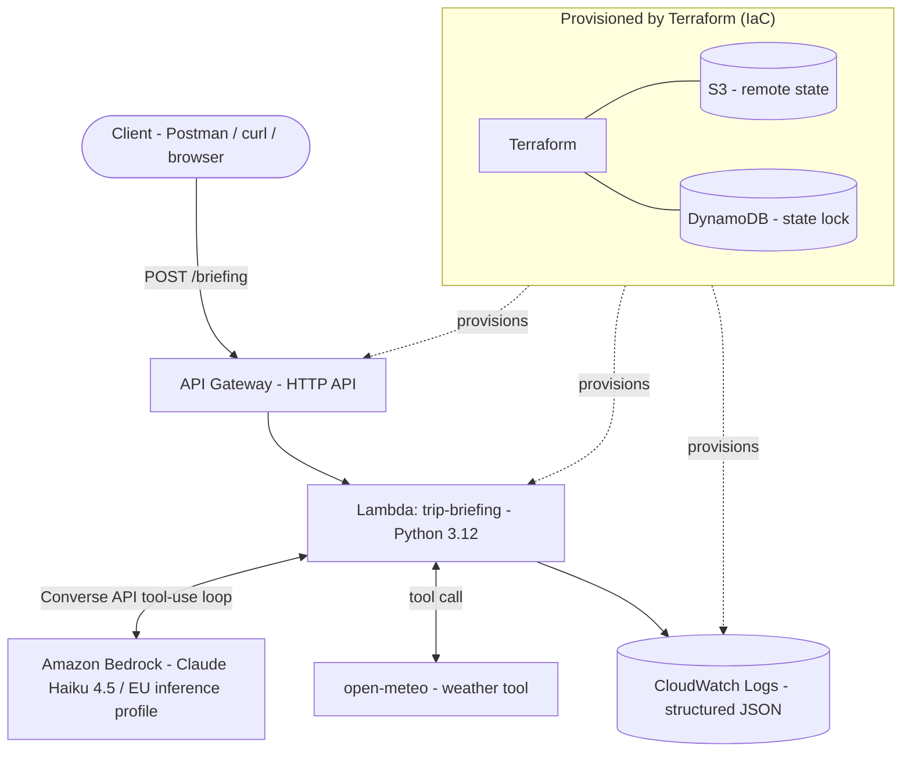

# Trip Briefing Agent — Serverless Agentic AI on AWS

A small agentic AI service deployed entirely on AWS, provisioned as Terraform
infrastructure-as-code and shipped through a CI pipeline. Given a destination,
an LLM decides whether to call a weather tool, then composes a short travel
briefing. Built as a focused exercise in cloud deployment, IaC, and production
concerns.

## What it does

You POST a destination to an HTTPS endpoint. Behind it, a Lambda runs an
agent loop against Amazon Bedrock (Claude): the model decides per request whether it needs a weather forecast, calls the `open-meteo` tool if so, and
writes a packing/planning briefing from real forecast data. If the tool fails,
the agent degrades gracefully and still responds.

## Architecture



Runtime path: API Gateway (HTTP API) → Lambda (Python 3.12) → Bedrock, with
`open-meteo` as a callable tool and structured logs to CloudWatch. The entire
stack — including remote state and the CI role — is defined in Terraform.

## Key design decisions

- **Amazon Bedrock over self-hosted models** — no GPU to run or pay for, and
  Bedrock's EU inference profiles keep data in-region for GDPR/residency.
  An on-prem Ollama build exists separately as a privacy-preserving reference.
- **EU inference profiles** — Claude is invoked via an `eu.` profile that
  routes across EU regions; the Lambda's IAM policy allows both the profile
  and the underlying regional model ARNs.
- **Genuinely agentic, not a pipeline** — the LLM controls the loop via
  Bedrock's tool-use (Converse API). Tool calls are conditional on the model's
  decision, not hard-coded. Verified in logs: irrelevant queries (e.g. a flight
  status question) skip the weather tool entirely.
- **Serverless (Lambda + API Gateway)** — scales to zero, near-zero cost for a
  learning workload.
- **Terraform with remote state** — state in S3, locking via DynamoDB, so the
  stack is reproducible and safe to tear down and rebuild identically.
- **Structured JSON logging** — every request logs the model's decisions,
  tool calls, and latency, queryable in CloudWatch.
- **CI with OIDC federation, plan-only** — GitHub Actions assumes a
  repo-scoped IAM role via short-lived OIDC tokens; no AWS keys are stored in
  GitHub. The CI role has read + state permissions but no create/delete, so a
  compromised pipeline cannot mutate infrastructure.

## Tech stack

AWS Lambda · API Gateway (HTTP API) · Amazon Bedrock (Claude) · DynamoDB ·
CloudWatch · Terraform · GitHub Actions · Python 3.12

## Deploy

Prerequisites: an AWS account with Bedrock model access enabled for Claude
(requires submitting the Anthropic use-case form in the Bedrock console), the
AWS CLI configured, and Terraform >= 1.9.

```bash
terraform init
terraform validate
terraform plan
terraform apply
```

`apply` outputs the API URL. Call it:

```bash
curl -X POST "<api_url>" \
  -H "Content-Type: application/json" \
  -d '{"text":"I am in Lisbon this weekend, what should I pack?"}'
```

Tear down with `terraform destroy`.

## Observability

Structured JSON logs stream to CloudWatch. Each request records the model's
stop reason per turn, any tool invocation and its arguments, tool errors, and
end-to-end latency:

```bash
aws logs tail /aws/lambda/trip-briefing --follow
aws logs tail /aws/lambda/trip-briefing --filter-pattern "tool_error"
```

## Notes and trade-offs

- **Cost**: designed for the AWS free tier; Bedrock is pay-per-token and
  negligible at this volume. Everything scales to zero when idle.
- **Observed performance**: ~2.3s when the model answers directly, ~5.4s when
  a tool call adds a second model turn. 90 MB peak of a 128 MB allocation.
- **Graceful degradation, verified in production**: a real `open-meteo` 400
  response was returned to the model as tool output rather than raised. The
  agent completed the briefing without forecast specifics instead of failing
  the request.
- **Deploy-time IAM**: the local deploying identity uses broad managed
  policies for convenience. In a real setup this would be a scoped custom
  policy or an assumed deployment role. The CI role, by contrast, is scoped
  to read + state operations only.
- **Endpoint is unauthenticated**: acceptable for a demo, not for production.
  An API key or authorizer and a Lambda concurrency cap would be the first
  additions for any real exposure.
- **CI is plan-only by design**: applies are run locally after reviewing the
  plan. Note that changes to the CI role's own permissions must be applied
  locally — a plan-only pipeline cannot grant itself anything.
- **Not added**: a persistence layer for cross-request memory. The agent is
  intentionally stateless.


## License

MIT
